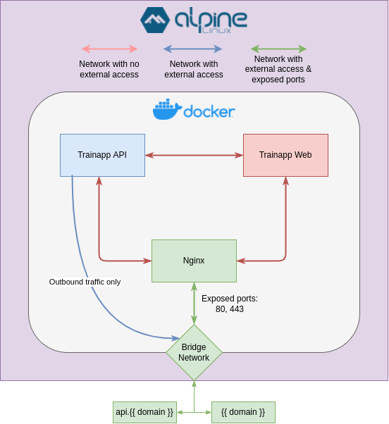

## Provisioning

### Requirements
- Alpine linux
- Python3 (installed)
- SSH Access

### Setup alpine host
1. Install alpine linux [Alpine Linux](https://www.alpinelinux.org/)
2. Add SSH key to root user.
3. Install python3 `apk add python3`


### Setup ansible environment
1. Ansible intalled on host follow: [Ansible Docs](https://docs.ansible.com/ansible/latest/installation_guide/index.html)
2. Update variables in `group_vars/all/general.yml` with your preference  
Variables that should be encrypted:
- hetzner_dns_api_token
- backend_email_pwd

How to encrypt string with ansible-vault:
```bash
$ ansible-vault encrypt_string --stdin-name={variable}
  New Vault password: ENTER VAULT PASSWORD
  Confirm New Vault password: ENTER VAULT PASSWORD AGIAN
  Reading plaintext input from stdin. (ctrl-d to end input, twice if your content does not already have a newline)
  {string/value to encrypt}
  {variable}: !vault |
            $ANSIBLE_VAULT;1.1;AES256
            34376565633230353231386266396639383461306436643132633363313561373638633534666536
            3666386238383933636631623338383866626233323762390a616239646462353063666361656662
            30643335363436666665663564326166336630396231636430316233343466653661623666356531
            3666366163643135630a343363646132356538343839316633323439646339633038653939393862
            64326166623664663737633833396132613136363266633461313733386435323735
```
Replace existing variable in `group_vars/all/general.yml` with yours.  

3. Create `inventory.yml`
Example file:
```yml
all:
  hosts:
    {ip | domain to server}
```

### Deploy application
To deploy application using ansible playbook steps in [Setup ansible environment](#setup-ansible-environment) after that is completed run:
```bash
$ ansible-playbook main.yml --ask-vault-password
```
Tasks will run when completed the infrastructre will be up and running.

### Reset database
To reset the database run:
```bash
$ ansible-playbook reset-db.yml --ask-vault-password
```
This will reseed the database, and set it to inital state.

## Result of deployment

